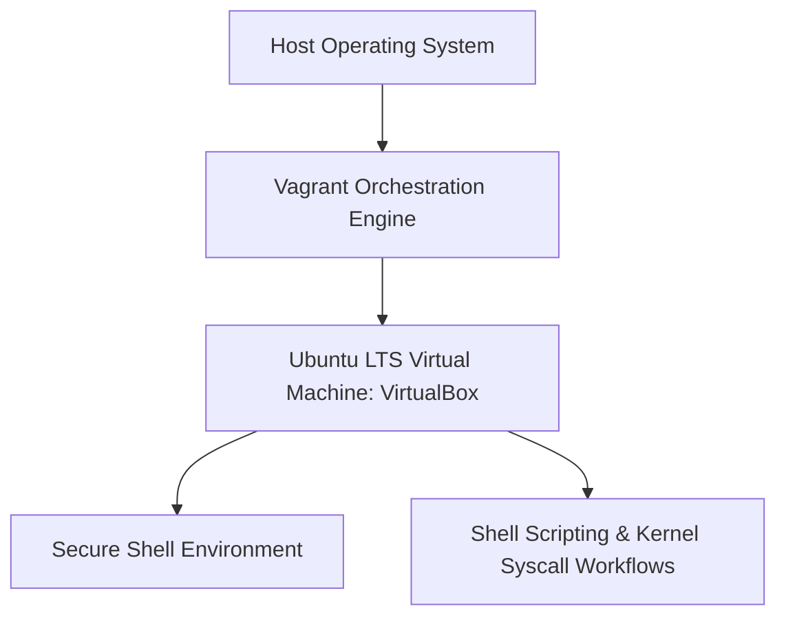

# ALX System Engineering: Vagrant & Virtualization Foundations

Automated provisioning, virtual machine configuration, and Linux system engineering workspace for ALX Software Engineering system administration projects.



## Overview

This repository documents the foundational systems engineering virtualization environment used throughout the ALX Software Engineering program. It establishes a reproducible Ubuntu Linux virtual machine via Vagrant to ensure consistent POSIX compliance, kernel compatibility, and isolated execution for low-level systems programming in C and Bash.

### Key Deliverables

- **`0x00-vagrant/`**: Vagrantfile configuration and Ubuntu 20.04/22.04 LTS initialization.
- **SSH Connectivity**: Automated key pair generation and port forwarding for terminal access.
- **POSIX Standardization**: Standard environment configuration for compiling with `gcc -Wall -Werror -Wextra -pedantic -std=gnu89`.

## Usage

```bash
# Provision virtual machine
vagrant up

# Access VM terminal
vagrant ssh
```
